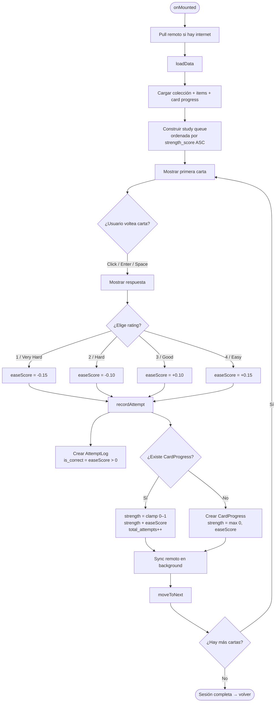
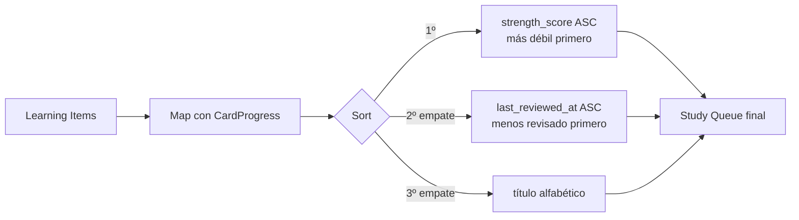
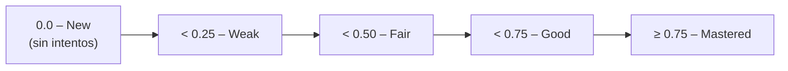

# StudyView — Flujo y Algoritmo

## Flujo principal

## Ordenamiento de la queue

## Escala de strength

## Notas

- La queue se construye **una sola vez** al iniciar la sesión. Las cartas falladas no se re-encolan dentro de la misma sesión.
- `strength_score` está clampeado entre `0` y `1`.
- Se necesitan ~5 respuestas correctas consecutivas para pasar de 0 → 0.50 (Fair).
- El sync con el backend ocurre en background sin bloquear la UI.
