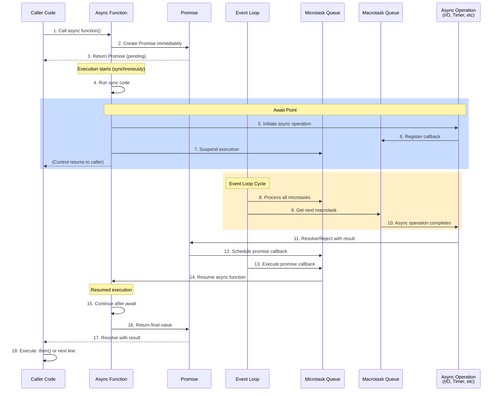
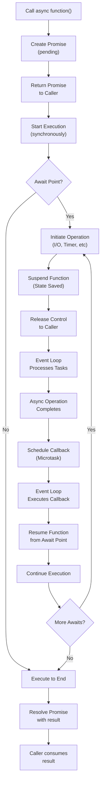

# Async Method Lifecycle Diagram

## Sequence Diagram: Async Method Lifecycle with All Actors



## Key Actors Explained

### 1. **Caller Code**
- Initiates the async function call
- Receives a Promise/Task immediately (non-blocking)
- Continues execution while operation is pending
- Can attach callbacks or await the result

### 2. **Async Function**
- Executes synchronously until the first `await` point
- Returns a Promise immediately (hot task)
- Execution is **suspended** at await points, not blocked
- Resumes when awaited operation completes

### 3. **Promise**
- Represents the eventual result of async work
- State: **pending** → **resolved** (fulfilled) or **rejected** (error)
- Holds the actual result/error value
- Notifies all listeners when state changes

### 4. **Event Loop**
- Single-threaded orchestrator in JavaScript
- Continuously processes tasks from queues
- Prioritizes microtasks over macrotasks
- Drives resumption of suspended functions

### 5. **Microtask Queue** (High Priority)
- Promise `.then()` callbacks
- `queueMicrotask()` calls
- `MutationObserver` callbacks
- Processed **completely** before next macrotask

### 6. **Macrotask Queue** (Lower Priority)
- `setTimeout()`/`setInterval()`
- File I/O operations
- UI events
- HTTP requests
- Only one macrotask processed per event loop cycle

### 7. **Async Operation**
- The actual I/O work: network call, file read, timer, database query
- Non-blocking from CPU perspective
- Handled by OS-level mechanisms
- Completes independently, then notifies runtime

---

## Lifecycle Stages Breakdown

### Stage 1: **Call & Initialization**
```
Caller invokes async function() 
→ Promise created immediately
→ Control returned to caller (non-blocking)
```

### Stage 2: **Synchronous Execution**
```
Async function runs synchronously
→ Executes code until first `await`
→ May complete synchronously if no await
```

### Stage 3: **Suspension at Await**
```
Function reaches `await` point
→ Operation initiated (e.g., fetch())
→ Function execution paused
→ State captured in state machine
→ Thread/execution context released
```

### Stage 4: **Pending State**
```
Promise is pending
→ Async operation in progress
→ Event loop processing other tasks
→ No thread blocked, waiting "free"
```

### Stage 5: **Operation Completion**
```
I/O operation finishes
→ Result/error available
→ Runtime notified (OS completion port)
→ Promise state changes (resolve/reject)
```

### Stage 6: **Callback Scheduling**
```
Promise resolves/rejects
→ Continuation callback scheduled
→ Added to microtask queue (high priority)
→ Event loop will process next
```

### Stage 7: **Resumption**
```
Event loop picks up microtask
→ Async function resumes execution
→ Awaited value now available
→ Continues from suspension point
```

### Stage 8: **Completion & Return**
```
Async function finishes execution
→ Returned value wrapped in Promise
→ Promise resolves with final result
→ Caller's callbacks triggered
→ Results available to consumer
```

---

## Task Execution Flow Chart



---

## Why This Matters

### **Non-Blocking Execution**
- Caller is never blocked
- Promise returned immediately
- Thread can handle other work
- Critical for scalability

### **Automatic State Management**
- Compiler generates state machine
- Locals preserved across suspensions
- No manual context switching
- Error handling works naturally with `try/catch`

### **Event Loop Coordination**
- Microtasks guarantee execution before next macrotask
- Prevents race conditions
- Ensures predictable ordering
- Enables responsive applications

### **Resource Efficiency**
- Single thread handles thousands of async operations
- No thread per operation overhead
- OS provides hardware-level I/O notifications
- Scales to massive concurrency

---

## Example: Fetch Data Scenario

```javascript
// Caller initiates
const promise = fetchUserData(123);  // Returns immediately

console.log("Request sent"); // Executes right away

// Async function
async function fetchUserData(id) {
  const response = await fetch(`/api/user/${id}`); // Suspend here
  const data = await response.json();              // And here
  return { id, ...data };                           // Return
}
```

**Timeline:**
1. `fetchUserData()` called → Promise created
2. `console.log()` executes immediately
3. `fetch()` initiated → function suspends
4. Event loop processes other tasks
5. Network response arrives → callback scheduled
6. Function resumes at first `await`
7. `.json()` called → function suspends again
8. JSON parsing completes → callback scheduled
9. Function resumes → returns final result
10. Promise resolves with data
