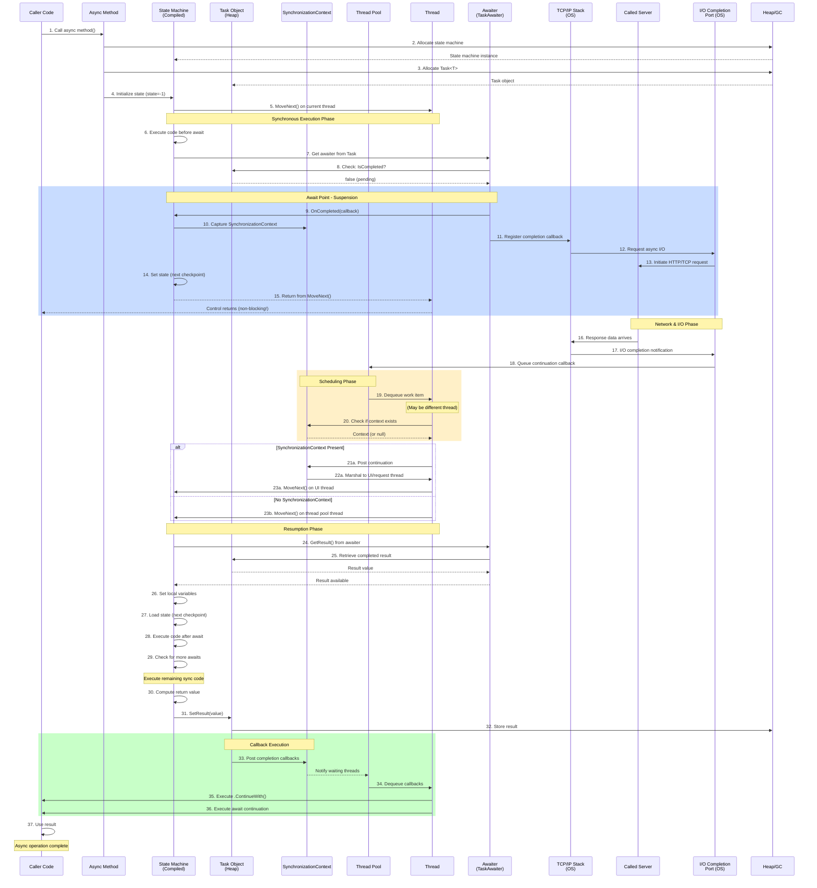
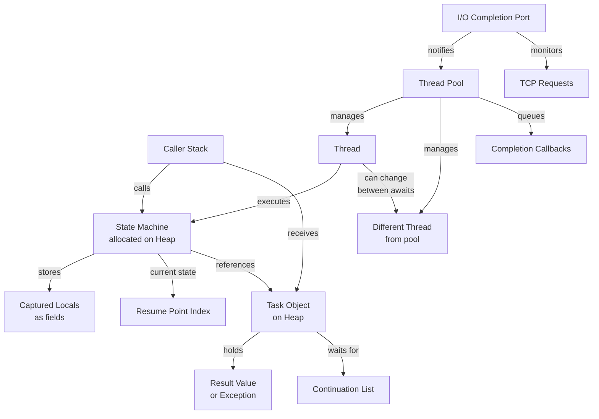
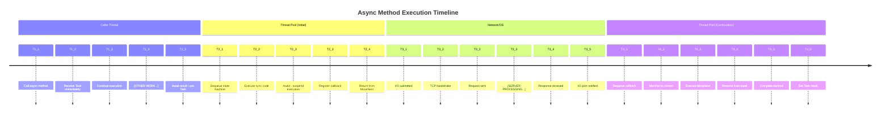

# C# Async Method Lifecycle - Complete Actor Model

## Comprehensive Sequence Diagram: All Actors Involved



---

## Detailed Actor Explanation for C#

### **1. Caller Code**
- Invokes async method
- Immediately receives Task (non-blocking)
- Can continue execution
- Later awaits or chains continuations with `.ContinueWith()`

### **2. Async Method**
- Declared with `async` keyword
- Compiled into state machine by compiler
- Returns Task/Task<T> immediately
- Not actually the method that executes—wrapper around state machine

### **3. State Machine (Struct on Stack/Heap)**
- Compiler-generated struct implementing `IAsyncStateMachine`
- Allocates locals and parameters as fields
- Contains `MoveNext()` method (state machine driver)
- Stores current state index for resumption points
- Allocated on heap if method actually suspends

### **4. Task Object (Heap)**
- Represents future result
- States: `NotStarted`, `Running`, `RanToCompletion`, `Faulted`, `Canceled`
- Stores result value or exception
- Notifies continuations when completed
- Reference type (heap allocation)

### **5. SynchronizationContext**
- Captured at await point
- Represents execution environment (UI thread, request context, etc.)
- Can be null (console app, thread pool context)
- `Post()` method marshals continuations to correct thread
- Prevents data corruption in single-threaded environments

### **6. Thread Pool (ThreadPool)**
- Managed pool of worker threads
- Minimal thread count (responsive to work immediately)
- Slow growth algorithm (hill-climbing)
- Queues work items and distributes to idle threads
- Prevents unbounded thread creation

### **7. Thread (Individual)**
- OS-level thread
- Has ~1MB stack memory
- Executes state machine's `MoveNext()`
- May change between suspension points (different thread)
- Owned by thread pool (not created per async operation)

### **8. Awaiter (TaskAwaiter<T>)**
- Obtained from awaitable via `GetAwaiter()`
- Implements `INotifyCompletion`
- Checks if operation already complete
- Registers `MoveNext()` callback via `OnCompleted()`
- Extracts result via `GetResult()`

### **9. TCP/IP Stack (OS Networking)**
- OS layer handling network protocols
- Manages socket state and buffers
- Non-blocking from application perspective
- Coordinates with I/O completion ports
- Handles retransmission, buffering, etc.

### **10. I/O Completion Port (OS)**
- Windows kernel mechanism (similar on other OS)
- Notified when I/O operation completes
- Wakes thread pool or specific thread
- Enables efficient async I/O without polling
- Handles hundreds of concurrent I/O with few threads

### **11. Called Server**
- Remote service or database
- Receives HTTP/TCP request
- Processes request
- Sends response back over network
- Delays are due to network latency + server processing time

### **12. Heap (Memory Management)**
- Allocates task objects
- May allocate state machine if needed
- Garbage collector manages lifetime
- Captures closures and variable captures
- Memory pressure can affect async performance

### **13. AsyncTaskMethodBuilder<T> (Not shown but implicit)**
- Runtime helper that builds Task
- Creates and manages state machine
- Calls `MoveNext()` at right times
- Handles exception propagation
- Optimizes for common cases (already-complete operations)

---

## Lifecycle Stages: C# Specific

### **Stage 1: Invocation**
```csharp
var task = FetchDataAsync(); // Returns Task immediately
// Method not executing yet, state machine queued
```
- State machine allocated
- Task created
- `MoveNext()` scheduled on thread pool

### **Stage 2: Initial Synchronous Execution**
```
Thread pool thread gets task
MoveNext(state=-1) executes
Runs code until first await
```
- On current thread pool thread
- All locals initialized
- No SynchronizationContext captured yet

### **Stage 3: Await Point**
```csharp
var response = await client.GetAsync(url); // Suspend here
```
- Awaiter obtained from Task
- `IsCompleted` checked (false)
- Callback registered: `OnCompleted(MoveNext)`
- Current state saved in state machine
- Function execution suspended
- **Thread released immediately**

### **Stage 4: I/O Submission**
```
HttpClient calls SendAsync()
  ↓
HttpClientHandler submits to socket
  ↓
TCP/IP stack queues to I/O port
  ↓
Network packet sent to server
```
- OS takes over
- **No thread waiting**
- I/O completion port watches for response

### **Stage 5: Pending State**
```
Application thread is FREE
Can handle other requests/operations
Task marked as RanToCompletion
No threads blocked
```
- Task in `Running` state logically
- But `MoveNext()` not executing
- Server processing request

### **Stage 6: I/O Completion**
```
Server sends response
  ↓
TCP/IP stack receives bytes
  ↓
I/O completion port notified
  ↓
Thread pool dequeued work item
```
- Different thread pool thread (likely)
- Result copied from kernel buffer
- Callback scheduled

### **Stage 7: Context Marshaling**
```
If SynchronizationContext captured:
  - Post continuation to context
  - UI thread/request thread executes callback
Else:
  - MoveNext() runs on thread pool thread directly
```

### **Stage 8: Resumption**
```
State machine MoveNext() called
  ↓
Switch on state (find resume point)
  ↓
GetResult() extracts value from Task
  ↓
Execute code after await
```
- State used to jump to correct location
- Locals restored from state machine fields
- Execution continues normally

### **Stage 9: Completion**
```csharp
// Async method finishes
return result; // Wrapped in Task<T>
```
- State machine calls `SetResult()`
- Task marked complete
- All continuations queued
- References cleaned up for GC

---

## Memory & Resource Model



---

## Critical Timing Flow



---

## Code Example: FetchUserAsync

```csharp
public async Task<User> FetchUserAsync(int userId)
{
    // BEFORE AWAIT - Synchronous execution on calling thread
    var url = $"https://api.example.com/users/{userId}";
    
    // AWAIT POINT 1 - Suspension happens here
    var response = await _httpClient.GetAsync(url);
    
    // BETWEEN AWAITS - Executes on thread pool thread (may differ)
    response.EnsureSuccessStatusCode();
    
    // AWAIT POINT 2 - Another suspension
    var json = await response.Content.ReadAsStringAsync();
    
    // AFTER LAST AWAIT - Back on correct context
    var user = JsonSerializer.Deserialize<User>(json);
    return user;
}
```

**Execution breakdown:**

1. **Caller calls** `FetchUserAsync(123)`
   - State machine allocated on heap
   - Task<User> created and returned immediately
   - Execution queued to thread pool

2. **Thread pool thread executes** `MoveNext(state=-1)`
   - Builds URL (sync, fast)
   - Reaches `await GetAsync()` 
   - Captures SynchronizationContext (if any)
   - Registers completion callback with HttpClient
   - **Thread released**

3. **While waiting:**
   - Caller continues execution
   - Thread pool thread handles other requests
   - OS/Network manages HTTP request
   - Server processes request

4. **Response arrives:**
   - I/O completion port notified
   - Thread pool picks callback
   - Different thread likely
   - `MoveNext()` called again

5. **Resumption** (new thread, state=1)
   - Extracts response value from awaiter
   - Calls `EnsureSuccessStatusCode()`
   - Reaches second `await ReadAsStringAsync()`
   - Registers completion callback
   - **Thread released again**

6. **Final response:**
   - Thread pool resumes again (state=2)
   - Deserializes JSON (sync, on thread pool thread)
   - Returns User object
   - Task marked complete

---

## Why Each Actor Matters

| Actor | Why It Matters | 
|-------|---|
| **State Machine** | Captures control flow; allows execution to suspend/resume |
| **Task** | Represents future result; enables caller to await without blocking |
| **Thread Pool** | Reuses threads across many async operations; scales to thousands |
| **Heap** | State machine allocation avoids stack overflow with deep recursion |
| **Awaiter** | Determines how completion is detected and callback registered |
| **I/O Completion Port** | OS provides async I/O without polling; enables true scalability |
| **SynchronizationContext** | Prevents data corruption in UI/request contexts; avoids deadlocks |
| **Thread** | Actually executes code; can change between await points |

---

## Key Insights

### **No Thread Blocking**
- Awaited operations don't hold threads
- Thread pool thread released immediately
- Same thread may not resume execution
- Enables thousands of concurrent operations with small thread pool

### **Compiler Magic**
- `async`/`await` syntactic sugar
- Compiled to state machine + task machinery
- No manual continuation plumbing needed
- Exception handling works naturally

### **Context Preservation**
- SynchronizationContext captured at await
- UI thread receives continuations on correct thread
- Request-scoped data flows through async chain
- Prevents concurrency bugs and data corruption

### **GC-Friendly Design**
- Task objects live on heap
- State machine may be optimized away if completes sync
- Locals captured as fields (survives across suspension)
- Allocations scale with actual async operations, not with code depth

---

## Memory Allocation Summary

```
Per async call:
├── State Machine struct (stack or heap)
│   ├── Locals & parameters (as fields)
│   ├── Current state index
│   └── Continuation info
│
├── Task<T> object (heap)
│   ├── Result value
│   ├── Exception (if faulted)
│   ├── Continuation list
│   └── State flags
│
└── Awaiter (often on stack)
    ├── Reference to Task
    └── Completion callback
```

Each layer adds minimal overhead; the real cost is in actual I/O and server response time, not async machinery.
