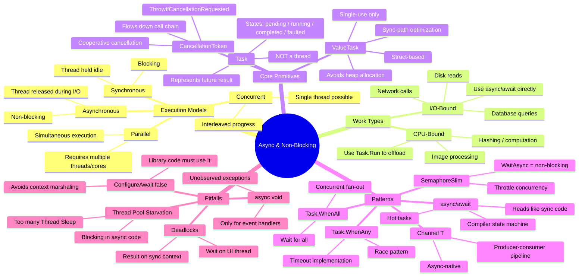
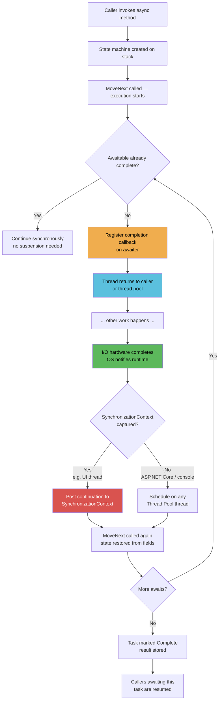
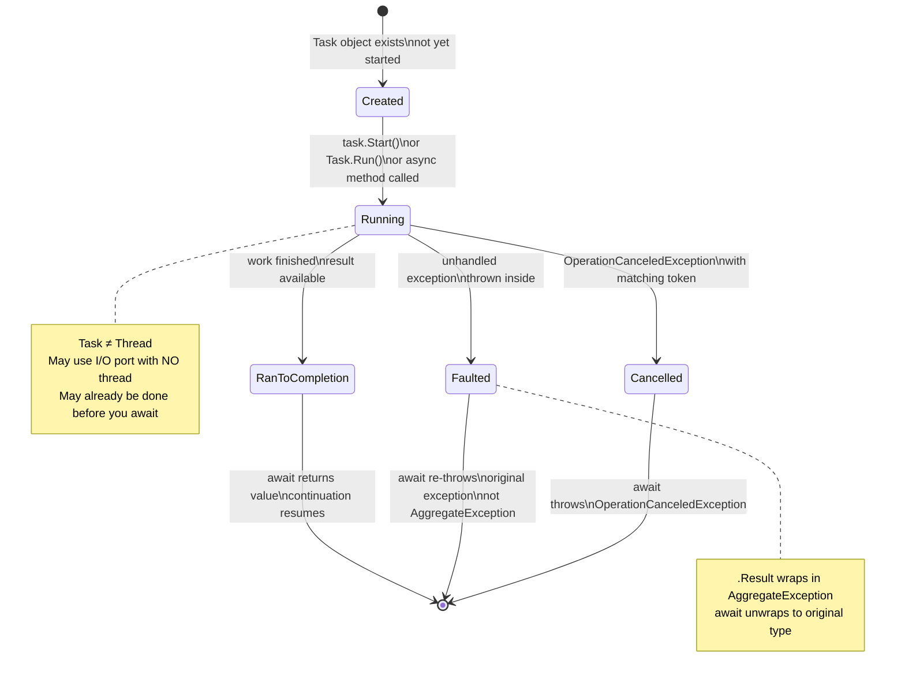
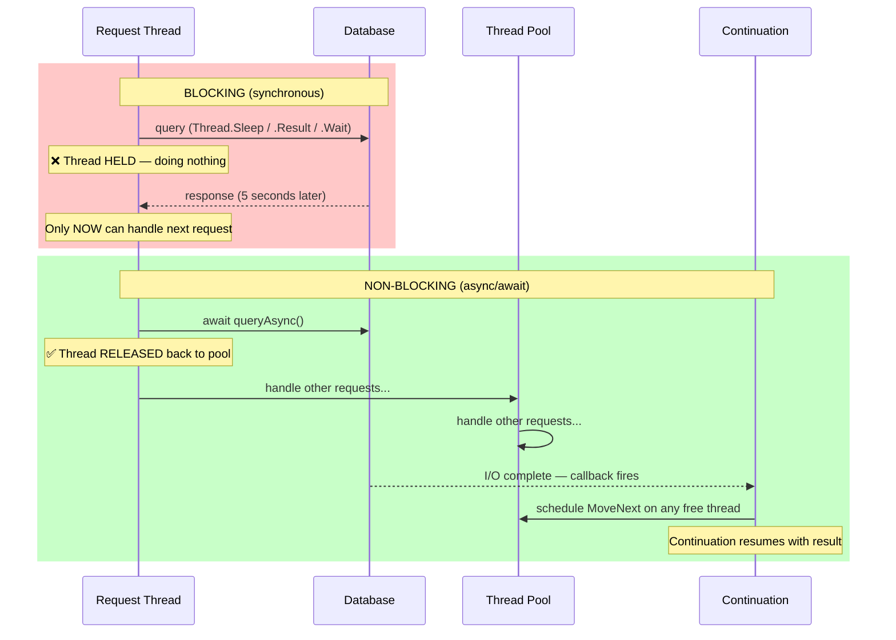
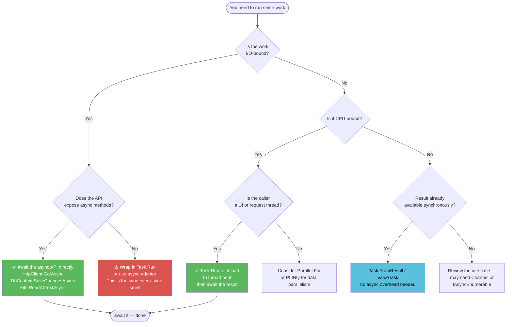
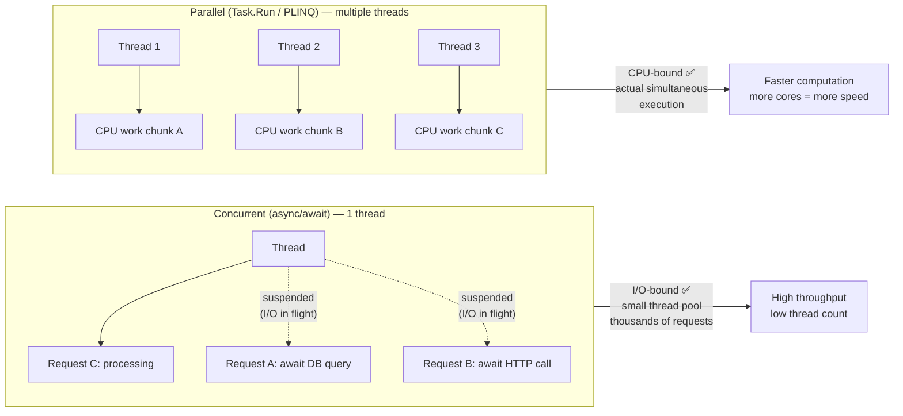
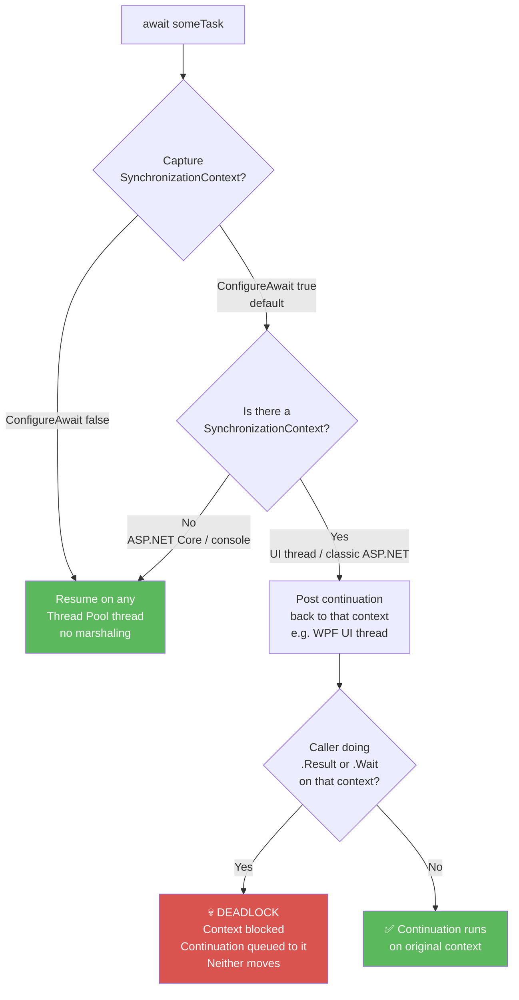
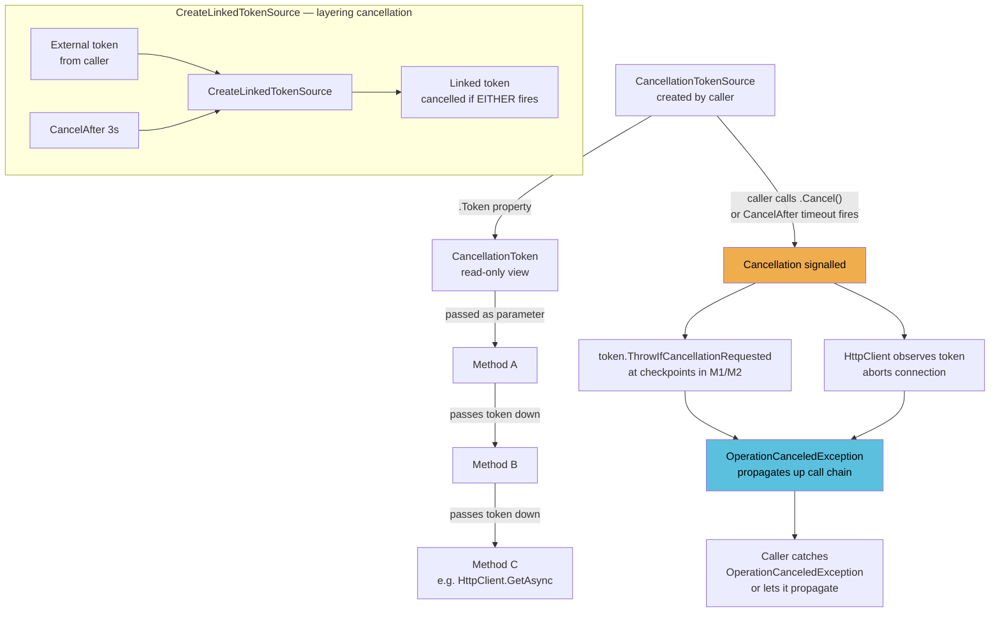
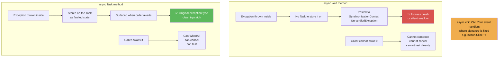

# Asynchrony & Non-Blocking — Concept Maps

---

## 1. The Big Picture: Concept Relationships

---

## 2. Runtime Execution Model (What Happens Under the Hood)

---

## 3. Task States & Lifecycle

---

## 4. Blocking vs Non-Blocking: Thread Behaviour

---

## 5. When to Use What — Decision Tree

---

## 6. Concurrency vs Parallelism

---

## 7. ConfigureAwait & SynchronizationContext

---

## 8. CancellationToken Flow

---

## 9. Task.WhenAll vs WhenAny vs Sequential

```mermaid
gantt
    title Task Execution Timing Comparison
    dateFormat  s
    axisFormat  %Ss

    section Sequential await
    Task A     :a1, 0, 3s
    Task B     :a2, after a1, 2s
    Task C     :a3, after a2, 4s
    Total 9s   :milestone, after a3, 0

    section Task.WhenAll (concurrent)
    Task A     :b1, 0, 3s
    Task B     :b2, 0, 2s
    Task C     :b3, 0, 4s
    Total 4s   :milestone, after b3, 0

    section Task.WhenAny (first wins)
    Task A     :c1, 0, 3s
    Task B     :c2, 0, 2s
    Task C     :c3, 0, 4s
    Done at 2s :milestone, after c2, 0
```

---

## 10. async void vs async Task — Exception Paths

