# DNS Resolution → TCP Connection → API Request Flow (Complete Network Layer)

```mermaid
sequenceDiagram
    participant Client as Client/Browser
    participant ISP_Resolver as ISP Resolver<br/>(Recursive)
    participant Root as Root Nameserver
    participant TLD as TLD Nameserver<br/>(.com, .org, etc)
    participant Auth as Authoritative<br/>Nameserver
    participant Network as Network/Router<br/>Infrastructure
    participant Server as Web Server

    rect rgb(255, 200, 200)
        Note over Client,Auth: === PHASE 1: DNS RESOLUTION ===

        Client->>Client: 1. User types URL<br/>api.example.com:443
        Note over Client: Browser checks cache first<br/>DNS cache (OS level)<br/>Browser cache<br/>Local hosts file
        
        alt DNS in Browser Cache
            Client->>Client: Use cached IP
        else DNS NOT in Cache
            Client->>ISP_Resolver: 2. Send DNS Query (UDP Port 53)<br/>Query: "What's IP for api.example.com?"<br/>Type: A (IPv4) or AAAA (IPv6)
            activate ISP_Resolver
            Note over ISP_Resolver: ISP's recursive resolver<br/>Caches common domains
            
            alt IP in Resolver Cache
                ISP_Resolver-->>Client: Return cached IP: 93.184.216.34
            else IP NOT in Cache (Recursive Query)
                ISP_Resolver->>Root: 3. Query Root Nameserver<br/>"Where's api.example.com?"
                activate Root
                Note over Root: 13 root servers worldwide<br/>Anycast routing<br/>Only knows TLDs, not domains
                
                Root-->>ISP_Resolver: 4. Response (Referral)<br/>"Ask the .COM TLD server"<br/>NS: a.gtld-servers.net<br/>IP: 192.5.6.30
                deactivate Root
                
                ISP_Resolver->>TLD: 5. Query TLD Nameserver<br/>"Where's example.com?"
                activate TLD
                Note over TLD: Manages all .com domains<br/>Geographically distributed<br/>Multiple replicas
                
                TLD-->>ISP_Resolver: 6. Response (Referral)<br/>"Ask example.com's authoritative server"<br/>NS: ns1.example.com<br/>IP: 208.77.188.166
                deactivate TLD
                
                ISP_Resolver->>Auth: 7. Query Authoritative Nameserver<br/>"What's IP for api.example.com?"
                activate Auth
                Note over Auth: Only server that knows<br/>the actual IP address<br/>Company/DNS provider manages it
                
                Auth-->>ISP_Resolver: 8. Response (Answer)<br/>A Record: api.example.com = 93.184.216.34<br/>TTL: 3600 (cache for 1 hour)<br/>Additional records:<br/>MX, TXT, CNAME (if needed)
                deactivate Auth
                
                ISP_Resolver-->>Client: 9. Return IP Address<br/>93.184.216.34<br/>TTL: 3600
            end
        end
    end
    
    deactivate ISP_Resolver
    
    Note over Client: Now Browser has: IP = 93.184.216.34
    
    rect rgb(200, 220, 255)
        Note over Client,Network: === PHASE 2: TCP CONNECTION ===
        
        Client->>Network: 10. Initialize Socket<br/>Create TCP socket<br/>socket = new Socket(AF_INET, SOCK_STREAM)
        Note over Client: AF_INET = IPv4<br/>SOCK_STREAM = TCP<br/>This allocates resources in OS
        
        Client->>Network: 11. TCP SYN (Synchronize)<br/>Packet Structure:
        Note over Client,Network: [Ethernet Header]<br/>Dest MAC: Router MAC<br/>Src MAC: Client MAC<br/><br/>[IP Header]<br/>Dest IP: 93.184.216.34<br/>Src IP: 192.168.1.100 (Client's IP)<br/>TTL: 64<br/><br/>[TCP Header]<br/>Dest Port: 443 (HTTPS)<br/>Src Port: 54321 (Random ephemeral port)<br/>Seq: 1000 (Random sequence number)<br/>Ack: 0<br/>Flags: SYN<br/>Window: 65535 (bytes it can receive)
        activate Network
        
        Note over Network: Router checks destination<br/>Routes packet to internet<br/>Multiple hops through ISP network<br/>Each router: decrement TTL<br/>ISP → Regional network → Backbone<br/>→ Server's ISP → Server's network
        
        Network->>Server: 12. Packet arrives at Server
        activate Server
        
        Server->>Server: Server OS receives SYN<br/>Creates half-open connection<br/>Allocates buffer memory<br/>Generates SYN-ACK response
        
        Server->>Network: 13. TCP SYN-ACK (Acknowledge)<br/>Packet Structure:
        Note over Server,Network: [IP Header]<br/>Dest IP: 192.168.1.100 (Client)<br/>Src IP: 93.184.216.34 (Server)<br/><br/>[TCP Header]<br/>Dest Port: 54321 (Echo client port)<br/>Src Port: 443<br/>Seq: 2000 (Server's sequence)<br/>Ack: 1001 (Acknowledges client's seq+1)<br/>Flags: SYN, ACK<br/>Window: 65535
        
        Network->>Client: 14. SYN-ACK received at Client
        deactivate Network
        
        Client->>Client: Client OS receives SYN-ACK<br/>Verifies acknowledgment number<br/>Connection moves to established state<br/>Generates ACK response
        
        Client->>Network: 15. TCP ACK (Acknowledge)<br/>Packet Structure:
        Note over Client,Network: [IP Header]<br/>Dest IP: 93.184.216.34<br/>Src IP: 192.168.1.100<br/><br/>[TCP Header]<br/>Dest Port: 443<br/>Src Port: 54321<br/>Seq: 1001 (Next expected)<br/>Ack: 2001 (Acknowledges server's seq+1)<br/>Flags: ACK<br/>Window: 65535<br/>Payload: (empty)
        activate Network
        
        Network->>Server: 16. ACK received at Server
        deactivate Network
        
        Server->>Server: Connection ESTABLISHED<br/>Server accepts connection<br/>Adds to listening queue<br/>Ready to receive data
        deactivate Server
        
        Client->>Client: Connection ESTABLISHED<br/>✓ Three-way handshake complete<br/>TCP connection ready<br/>Can now send application data
    end
    
    rect rgb(200, 255, 200)
        Note over Client,Server: === PHASE 3: TLS HANDSHAKE (HTTPS) ===
        
        Note over Client: Since using HTTPS (port 443)<br/>Must establish TLS/SSL encryption<br/>Before sending HTTP data
        
        Client->>Server: 17. TLS ClientHello<br/>Sent as TCP data (now reliable delivery)<br/>Specifies:
        Note over Client,Server: - TLS version: 1.3<br/>- Supported cipher suites<br/>- Supported compression<br/>- Random number (nonce)<br/>- Session ID (if resuming)<br/>- Extensions: SNI, ALPN, etc.
        activate Server
        
        Server->>Client: 18. TLS ServerHello + Certificate<br/>Server sends:
        Note over Server,Client: - Chosen cipher suite<br/>- Chosen TLS version<br/>- Server random (nonce)<br/>- Server Certificate chain<br/>  - Leaf cert (api.example.com)<br/>  - Intermediate cert<br/>  - Root cert (trusted CA)
        
        Client->>Client: 19. Verify Certificate<br/>Browser performs:
        Note over Client: 1. Check certificate not expired<br/>2. Verify domain matches<br/>3. Verify signature chain<br/>4. Check revocation (OCSP)<br/>5. Verify chain leads to trusted root CA<br/><br/>If invalid → TLS error<br/>If valid → Continue
        
        Client->>Server: 20. Key Exchange<br/>Depending on cipher suite:
        Note over Client,Server: TLS 1.3 (modern):<br/>- Client Finished with shared secret<br/>- All data after this is encrypted!<br/><br/>TLS 1.2 (older):<br/>- Client sends encrypted PreMasterSecret<br/>- Server sends Finished
        
        Server->>Client: 21. Server Finished
        Note over Server,Client: All data now encrypted both ways<br/>Cipher: AES-256-GCM<br/>HMAC for authentication<br/>Compression: (usually disabled)
        deactivate Server
        
        Client->>Client: TLS Connection Established ✓<br/>Now have secure tunnel<br/>Can send HTTP requests safely
    end
    
    rect rgb(255, 240, 200)
        Note over Client,Server: === PHASE 4: HTTP/API REQUEST ===
        
        Client->>Server: 22. HTTP Request (encrypted in TLS)<br/>GET /api/v1/users/profile HTTP/1.1
        activate Server
        
        Note over Client,Server: At this point:<br/>- DNS resolved domain to IP<br/>- TCP established reliable connection<br/>- TLS established encryption<br/>- HTTP carries the actual request<br/>- Server's web server handles it
        
        Server-->>Client: 23. HTTP Response (encrypted in TLS)
        deactivate Server
    end
```



---

## **What Happens in the Middle? (The Network Journey)**

### **DNS Query Journey:**

```
Client (192.168.1.100)
    ↓ (UDP packet to ISP resolver)
ISP Resolver (8.8.8.8)
    ↓ (Query root nameserver)
Root Nameserver (193.128.5.8)
    ↓ (referral to TLD)
TLD Nameserver (192.5.6.30)
    ↓ (referral to authoritative)
Authoritative Nameserver (208.77.188.166)
    ↓ (ANSWER: api.example.com = 93.184.216.34)
    
Response travels back through same path
    ↓
ISP Resolver (caches result, TTL 3600)
    ↓
Client receives IP: 93.184.216.34
```

**Key Points:**
- **Recursive Query**: Client asks ISP, ISP asks root, TLD, authoritative
- **Each server only knows the NEXT step**, not the final destination
- **Caching**: Each level caches the response for TTL seconds
- **UDP Protocol**: Used because DNS queries are small, fast, stateless

---

### **TCP Three-Way Handshake Journey:**

#### **Step 1: SYN**
```
Client OS creates packet with flags:
┌─────────────────────────────────┐
│ Dest IP: 93.184.216.34          │
│ Dest Port: 443                  │
│ Src IP: 192.168.1.100           │
│ Src Port: 54321 (random)        │
│ Seq: 1000 (random)              │
│ Ack: 0                          │
│ Flags: SYN                      │
└─────────────────────────────────┘

Path through network:
Client → Client's Router (192.168.1.1)
       → ISP's network
       → Regional network
       → Internet backbone (multiple paths)
       → Server's ISP
       → Server's network
       → Server's OS

On each hop, router:
- Checks IP destination
- Decrements TTL (time to live)
- Forwards to next hop
- Updates MAC addresses (link layer)
```

#### **Step 2: SYN-ACK**
```
Server OS receives SYN
→ Creates half-open connection entry
→ Allocates buffer (socket)
→ Generates response:

┌─────────────────────────────────┐
│ Dest IP: 192.168.1.100          │
│ Dest Port: 54321 (echo of src)  │
│ Src IP: 93.184.216.34           │
│ Src Port: 443                   │
│ Seq: 2000 (new random)          │
│ Ack: 1001 (client seq + 1)      │
│ Flags: SYN, ACK                 │
└─────────────────────────────────┘

Same path but reversed
Server network → Internet backbone → Server's ISP → Client's network
```

#### **Step 3: ACK**
```
Client receives SYN-ACK
→ Verifies Ack number is correct (seq + 1)
→ Connection state: ESTABLISHED
→ Sends ACK:

┌─────────────────────────────────┐
│ Seq: 1001 (next byte to send)   │
│ Ack: 2001 (server seq + 1)      │
│ Flags: ACK                      │
│ Payload: empty                  │
└─────────────────────────────────┘

Server receives ACK
→ Verifies Ack number
→ Connection state: ESTABLISHED
→ Accepts next data on this connection

✓ Both sides agree: connection is ready for data
```

---

## **Why This Matters: TCP vs UDP**

```
TCP (Transmission Control Protocol):
├── Reliable (data arrives in order)
├── Connection-oriented (handshake required)
├── Slower (but guaranteed)
├── Used for: HTTP, HTTPS, Email, FTP
└── Flow control: receiver tells sender how much it can accept

UDP (User Datagram Protocol):
├── Unreliable (data may be lost, reordered)
├── Connectionless (no handshake)
├── Faster (less overhead)
├── Used for: DNS, Video streaming, Online games
└── No flow control: fire and forget
```

---

## **The Complete Network Stack**

When you send a request, it travels through layers:

```
Application Layer     → HTTP/HTTPS request
                      ↓
Transport Layer       → TCP packet (port 443, sequence numbers)
                      ↓
Internet Layer        → IP packet (routing, 93.184.216.34)
                      ↓
Link Layer            → Ethernet frame (MAC addresses)
                      ↓
Physical Layer        → Electrical signals / WiFi waves
                      ↓
                      [Network/Router/ISP]
                      ↓
Physical Layer        → Receive signals
                      ↓
Link Layer            → Parse Ethernet frame
                      ↓
Internet Layer        → Route based on IP
                      ↓
Transport Layer       → Verify TCP checksum, sequence order
                      ↓
Application Layer     → Pass to web server application
```

---

## **What Actually Gets Sent (Real Example)**

### **DNS Query (56 bytes)**
```
Transaction ID: 0x1234
Flags: Standard query
Questions: 1
    Name: api.example.com
    Type: A (IPv4)
    Class: IN (Internet)
```

### **TCP SYN Packet (60 bytes)**
```
[Ethernet Header - 14 bytes]
  Dest MAC: 00:00:5e:00:53:01 (router)
  Src MAC: 08:00:27:7f:b4:a3 (client)
  Type: 0x0800 (IPv4)

[IP Header - 20 bytes]
  Version: 4
  Header Length: 5
  Total Length: 60
  Identification: 12345
  Flags: Don't Fragment
  TTL: 64
  Protocol: 6 (TCP)
  Checksum: calculated
  Src IP: 192.168.1.100
  Dest IP: 93.184.216.34

[TCP Header - 20 bytes]
  Src Port: 54321
  Dest Port: 443
  Sequence Number: 1000000000
  Acknowledgment: 0
  Data Offset: 5
  Flags: SYN (0x02)
  Window Size: 65535
  Checksum: calculated
  Urgent Pointer: 0
```

---

## **Why DNS Passes IP to TCP**

**DNS's job:** Answer the question "What's the IP for api.example.com?"
**Answer:** 93.184.216.34

**TCP's job:** Establish reliable connection to that IP on a specific port
**How:** Use the IP 93.184.216.34 + Port 443 → Create connection

**The connection:** Identified by tuple (src_ip, src_port, dest_ip, dest_port)
- From: (192.168.1.100, 54321) 
- To: (93.184.216.34, 443)

This tuple is unique and ensures packets arriving at the server go to the right process.

---

## **Timing Breakdown**

```
DNS Resolution:
├── Browser cache check: <1ms
├── ISP cache check: <1ms
├── Full recursive query: 50-300ms
│   ├── Client → ISP: 5ms
│   ├── ISP → Root: 20ms
│   ├── Root → TLD: 20ms
│   ├── TLD → Authoritative: 20ms
│   └── Return path: 50ms
└── Result: cached for TTL (3600 seconds)

TCP Handshake:
├── Send SYN: <1ms
├── Network latency (SYN → Server): 50-200ms
├── Server processes SYN: <1ms
├── Send SYN-ACK back: <1ms
├── Network latency (SYN-ACK → Client): 50-200ms
├── Client sends ACK: <1ms
├── Network latency (ACK → Server): 50-200ms
└── Total: ~100-400ms (mostly network latency)

TLS Handshake:
├── ClientHello: <1ms + network latency
├── ServerHello: <1ms + network latency
├── Key exchange: <1ms + network latency
├── Certificate verification: 50-200ms
└── Total: ~150-600ms

HTTP Request:
├── Send request data: <1ms + network latency
├── Server processing: varies
├── Receive response: varies
└── Total: varies (50ms - several seconds)

TOTAL (first time): ~400ms - 1.5s
TOTAL (cached DNS): ~250ms - 1.2s
```

---

## **Common Confusions Cleared**

### **Q: Why doesn't DNS give the server name?**
A: DNS is for hostname → IP resolution only. It's a simple lookup service. Routing on the internet works with IPs, not names. Each nameserver only knows the next step, not the whole path.

### **Q: What's inside a network packet?**
A: Nested headers:
```
[Ethernet Frame]
  ├─ Destination MAC (link-local)
  └─ [IP Packet]
       ├─ Source IP (sender)
       ├─ Dest IP (receiver)
       └─ [TCP Segment]
            ├─ Source Port
            ├─ Dest Port
            ├─ Sequence Number
            └─ [Application Data]
                 └─ HTTP request body
```

### **Q: How does the server know to send back to the client?**
A: Packets contain full address information:
- IP header has source IP (client sends its own IP)
- TCP header has source port (client sends a random port)
- Server responds to (src_ip, src_port) tuple

### **Q: What if TTL reaches 0?**
A: Packet is discarded. Error sent back to source. Prevents infinite loops. Default TTL: 64 (supports ~64 hops)

### **Q: What if TCP packet is lost?**
A: TCP has retransmission:
- Client sends SYN, waits for SYN-ACK
- If no response within timeout (usually 1 second), resend SYN
- Retry ~6 times with exponential backoff
- If all retries fail: "Connection refused" or "Timeout"

