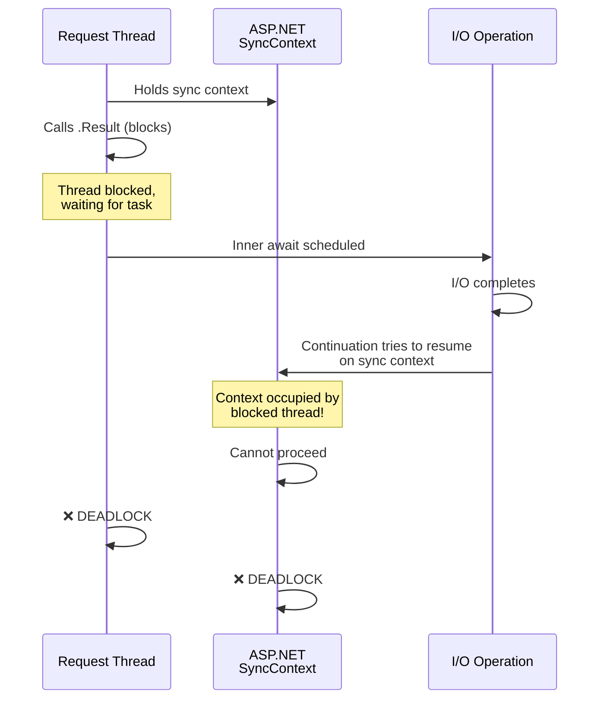
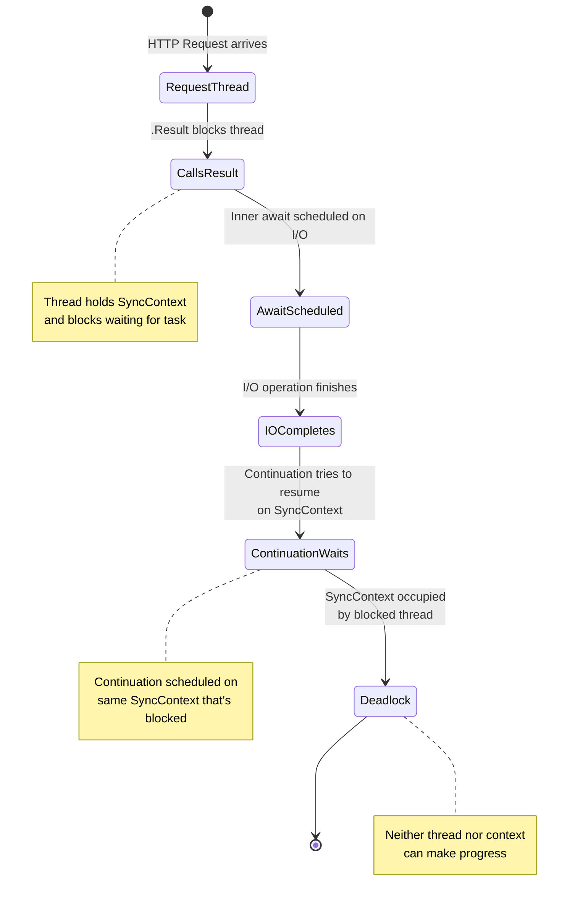
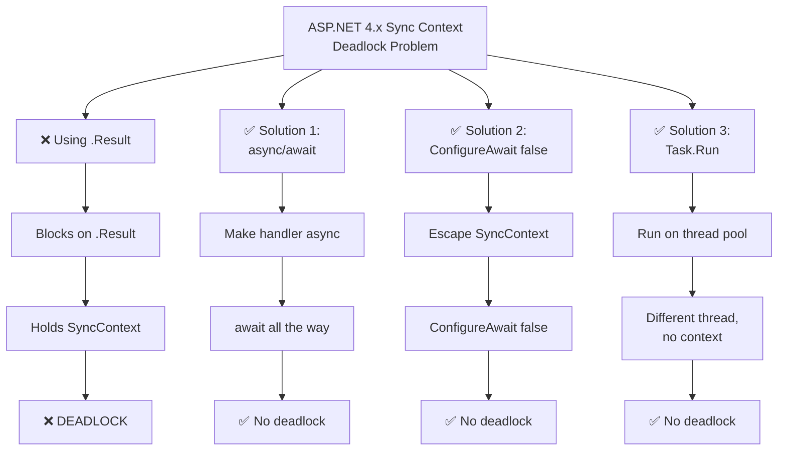

# ASP.NET 4.x SynchronizationContext Deadlock

## The Deadlock Scenario



## Execution Timeline

```mermaid
gantt
    title ASP.NET 4.x Deadlock Timeline
    dateFormat YYYY-MM-DD HH:mm:ss
    
    section Request Thread
    Hold SyncContext :active, thread1, 2026-05-19 12:00:00, 10s
    .Result blocks thread :crit, thread2, 2026-05-19 12:00:01, 9s
    
    section SyncContext
    Occupied by thread :crit, ctx1, 2026-05-19 12:00:01, 9s
    Waiting for continuation :crit, ctx2, 2026-05-19 12:00:05, 4s
    
    section I/O Operation
    Async work :, io1, 2026-05-19 12:00:02, 3s
    Tries to schedule continuation :crit, io2, 2026-05-19 12:00:05, 1s
    
    section Result
    Deadlock :crit, dead1, 2026-05-19 12:00:06, 3s
```

## State Diagram



## Solution Comparison


