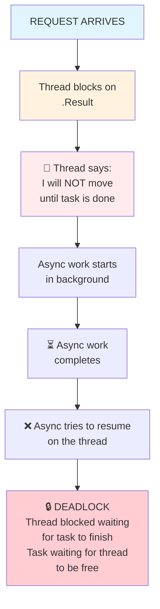
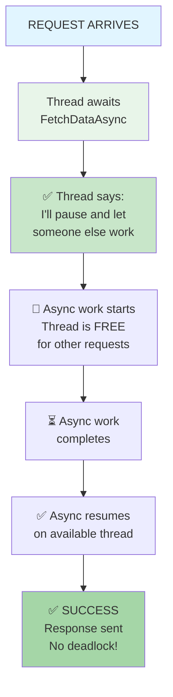
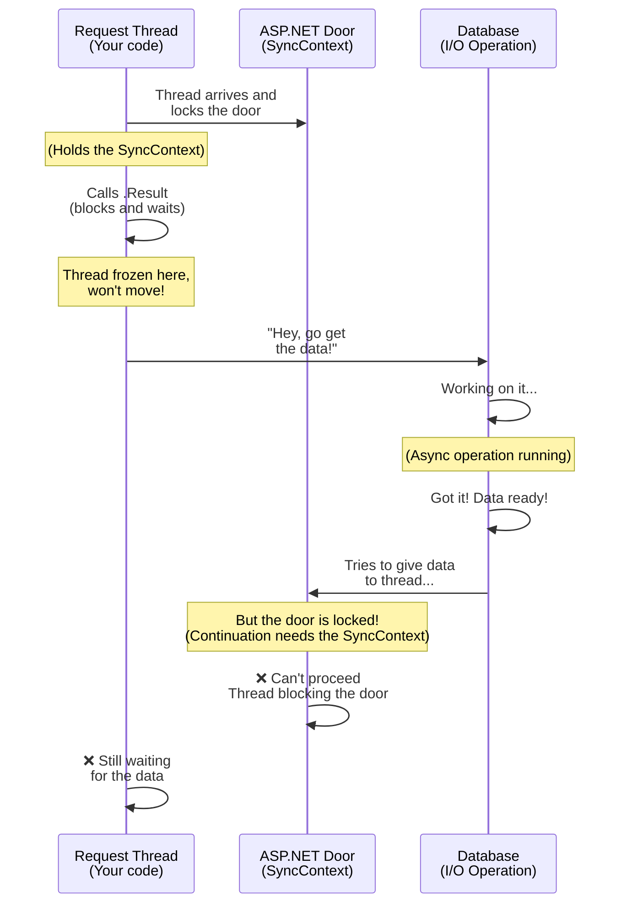
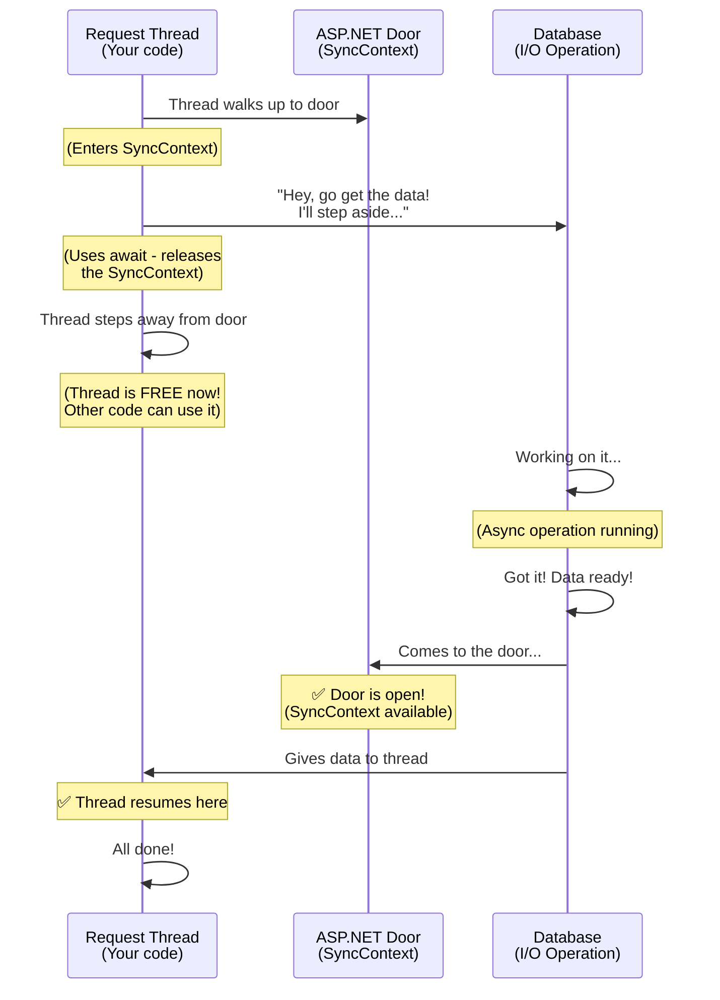

# ASP.NET 4.x Deadlock Explained Simply

## The Problem Code

```csharp
public IHttpActionResult GetData()
{
    // This line causes a DEADLOCK in ASP.NET 4.x
    var result = FetchDataAsync().Result;
    return Ok(result);
}

private async Task<string> FetchDataAsync()
{
    await Task.Delay(100);  // Simulate waiting for database or API
    return "data";
}
```

## Real-World Analogy: Restaurant Waiter

Think of it like a restaurant scenario:

**The Deadlock Situation:**

1. **Waiter (Request Thread)** takes an order from a customer
2. **Waiter is at the door (holding the entrance)** - he CANNOT leave
3. Waiter shouts "Make my food!" to the kitchen (calls `FetchDataAsync()`)
4. Waiter then **stands at the door blocking it** (calls `.Result` - BLOCKING)
5. The waiter says: "I will NOT move until the food is done"
6. Kitchen finishes the food
7. Kitchen tries to send food to the waiter...
8. **But the waiter is blocking the door!** No one can get to him
9. 🔒 **DEADLOCK** - Waiter waits for food, kitchen can't deliver food

---

## Step-by-Step What Happens

### Step 1: Request arrives
```
User requests data from your controller
↓
Request thread starts
```

### Step 2: You call .Result
```csharp
var result = FetchDataAsync().Result;  // ← This blocks!
```

The thread says: **"I am going to WAIT here and NOT do anything else until the task is done"**

### Step 3: Inside FetchDataAsync, you await
```csharp
await Task.Delay(100);  // ← This releases the work
```

The async method says: **"I will pause here and let something else use this thread"**

### Step 4: I/O completes (like a database returns data)
```
Database: "I'm done! Here's your data!"
Async method: "Great! I need to tell the original thread"
```

### Step 5: THE PROBLEM 🔒
```
Async method tries to resume: "Hey thread, I'm done!"
Thread responds: "Sorry, I can't listen. I'm blocking on .Result"
Both are stuck waiting for each other
```

---

## Visual Timeline - .Result (BAD - DEADLOCK)



## Visual Timeline - await (GOOD - NO DEADLOCK)



---

## The Fix: Make it Async All The Way

```csharp
// ✅ FIXED - Make the whole thing async
public async Task<IHttpActionResult> GetData()
{
    var result = await FetchDataAsync();  // ← Uses await, NOT .Result
    return Ok(result);
}

private async Task<string> FetchDataAsync()
{
    await Task.Delay(100);
    return "data";
}
```

### Why this works:

```
TIME 0:  [Thread awaits FetchDataAsync()]
         Thread says: "I'll pause here and let someone else work"
          ↓
TIME 1:  [Async work starts, thread is FREE]
         [Other requests can use the thread!]
          ↓
TIME 2:  [Async work completes]
         [Thread is available again, so it resumes]
         Thread says: "Oh! You're done? Great, let me continue"
          ↓
TIME 3:  ✅ No deadlock - everything works!
```

---

## Visual Explanation with Sequence Diagram

### What's Happening Step-by-Step (The Bad Way)



**What's happening in plain English:**
1. Your request thread locks the door (holds the SyncContext)
2. Thread says "I'm waiting here and I won't let go of this door"
3. Database finishes and tries to come through the door
4. But the thread is still blocking it! They're stuck forever.

---

### What's Happening Step-by-Step (The Good Way)



**What's happening in plain English:**
1. Thread arrives and unlocks the door (uses await)
2. Thread says "I'll wait, but you can use this door while I'm waiting"
3. Database finishes and can easily come through
4. Thread wakes up and continues. Everyone's happy!

---

### Timeline View (Compare Both Approaches)

```mermaid
gantt
    title The Deadlock Problem: .Result blocks, await doesn't
    dateFormat HH:mm:ss
    
    section ❌ Bad (.Result)
    Thread locks door :crit, bad1, 00:00:00, 5s
    Thread frozen (won't move) :crit, bad2, 00:00:01, 4s
    Database finishes :active, bad3, 00:00:03, 1s
    Database tries to resume :crit, bad4, 00:00:04, 1s
    🔒 DEADLOCK :crit, bad5, 00:00:05, 10s
    
    section ✅ Good (await)
    Thread uses door :active, good1, 00:00:00, 1s
    Thread steps aside :active, good2, 00:00:01, 2s
    Database works :active, good3, 00:00:01, 2s
    Database resumes :active, good4, 00:00:03, 1s
    ✅ SUCCESS :done, good5, 00:00:04, 1s
```



---

## Key Difference

| | `.Result` (BAD) | `await` (GOOD) |
|---|---|---|
| Blocking? | YES - thread is stuck | NO - thread is free |
| Can async resume? | NO - thread is busy | YES - thread is available |
| Result | 🔒 DEADLOCK | ✅ Works perfectly |

---

## Remember This:

🚫 **NEVER use `.Result` in ASP.NET 4.x**

✅ **Always use `await` instead**

It's that simple!
