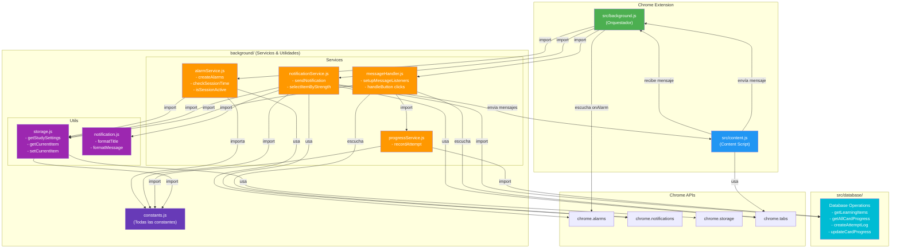

# Background Scripts Architecture

## Diagrama General



## Flujo de Ejecución

### 1. Inicialización (onInstalled, onStartup)
```
background.js
    ↓
initializeAlarms()
    ↓
alarmService.createAlarms()
    ↓
chrome.alarms.create("sessionAlarm")
chrome.alarms.create("notificationAlarm")
```

### 2. Verificación de Sesión (cada 1 minuto)
```
chrome.alarms.onAlarm (sessionAlarm)
    ↓
alarmService.checkSessionTime()
    ↓
getStudySettings() → chrome.storage.local.get()
    ↓
actualiza sessionActive flag
```

### 3. Envío de Notificación (cada N segundos si sesión activa)
```
chrome.alarms.onAlarm (notificationAlarm)
    ↓
notificationService.sendNotification()
    ↓
getStudySettings() → getLearningItems() → getAllCardProgress()
    ↓
selectItemByStrength() → elige item
    ↓
chrome.notifications.create() (notificación nativa)
    ↓
chrome.tabs.sendMessage() (envía a content script)
```

### 4. Grabación de Intento (usuario hace click)
```
chrome.notifications.onButtonClicked
    ↓
messageHandler.handleNotificationButtonClick()
    ↓
progressService.recordAttempt(itemId, buttonIndex)
    ↓
createAttemptLog() → syncAttemptLogs()
    ↓
updateCardProgress() o createCardProgress()
    ↓
syncCardProgress()
    ↓
chrome.notifications.clear()
```

## Responsabilidades de cada módulo

### alarmService.js
- ⏰ Gestión de alarmas de Chrome
- 📊 Control del estado de sesión (activa/inactiva)
- 🔄 Coordinación con intervalos de notificación

### notificationService.js
- 📱 Selección inteligente de items (basada en strength)
- 🎨 Creación de notificaciones nativas
- 💬 Envío de mensajes a content script
- 🎯 Lógica de priorización (weak → good → mastered)

### progressService.js
- 📝 Grabación de intentos de usuario
- 📊 Actualización del strength_score
- 🔄 Sincronización con base de datos
- ⚙️ Cálculo de ease scores

### messageHandler.js
- 👂 Escucha de eventos de Chrome
- 📨 Manejo de mensajes del content script
- 🔗 Puente entre background y content scripts
- 🧹 Limpieza de notificaciones

### storage.js
- 💾 Gestión de configuraciones de estudio
- 📦 Almacenamiento del item actual en notificación
- 🔍 Recuperación de datos locales

### notification.js
- ✂️ Extracción de texto plano de contenido
- 📏 Formateo y truncado de títulos/mensajes
- 🎭 Conversión de estructura Tiptap a texto

### constants.js
- 🔢 Todos los valores configurables
- ⏱️ Intervalos de tiempo
- 🏷️ Labels y configuraciones por defecto

## Comunicación entre Scripts

### background.js ↔ content.js

**Background envía a Content:**
```javascript
chrome.tabs.sendMessage(tabId, {
  action: 'showQuestion',    // Mostrar modal
  item: nextItem,
  notificationId: notificationId
})

chrome.tabs.sendMessage(tabId, {
  action: 'hideQuestion'     // Ocultar modal
})
```

**Content envía a Background:**
```javascript
chrome.runtime.sendMessage({
  action: 'buttonClicked',    // Usuario clickeó botón
  buttonIndex: 0,
  notificationId: notificationId
})

chrome.runtime.sendMessage({
  action: 'questionClosed'    // Usuario cerró modal
  notificationId: notificationId
})
```

## Flujos de Datos

### Lectura de Configuración
```
messageHandler/alarmService
    ↓
storage.getStudySettings()
    ↓
chrome.storage.local.get([keys])
    ↓
Retorna: {collectionId, startHour, endHour, intervalSeconds}
```

### Selección de Item para Notificación
```
notificationService.selectItemByStrength()
    ↓
Calcula strength para cada item
    ↓
Prioriza: weak (0-0.5) > good (0.5-0.8) > mastered
    ↓
Usa weighted random selection
    ↓
Retorna: bestItem
```

### Actualización de Progreso
```
progressService.recordAttempt(itemId, buttonIndex)
    ↓
Obtiene easeScore del button
    ↓
createAttemptLog() + syncAttemptLogs()
    ↓
Calcula newStrength = strength + easeScore
    ↓
updateCardProgress() + syncCardProgress()
    ↓
Database sincronizada
```
