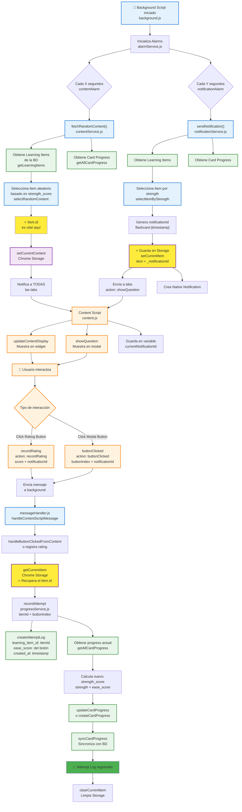

# Flujo de Extracción y Registro de Learning Items

## Diagrama Mermaid



---

## Explicación del flujo (paso a paso)

### 1️⃣ **EXTRACCIÓN DEL LEARNING ITEM**

**Módulo: `contentService.js` y `notificationService.js`**

- Cada X segundos → `fetchRandomContent()` obtiene items de la BD
- Selecciona uno aleatorio según `strength_score` (favorece items débiles)
- **⭐ El `item.id` se obtiene aquí y es CRUCIAL**

### 2️⃣ **ALMACENAMIENTO EN CHROME STORAGE**

**Módulo: `storage.js`**

```javascript
// El item completo con su ID se guarda en Chrome Local Storage
await setCurrentItem({ 
  ...item,           // ← Contiene id, title, content
  _notificationId: notificationId
})
```

### 3️⃣ **MOSTRACIÓN EN UI**

**Módulo: `content.js`**

- Recibe mensaje: `action: 'showQuestion'`
- Muestra el modal y widget con el contenido
- **Guarda `notificationId` en variable** `currentNotificationId`

### 4️⃣ **REGISTRO DE ATTEMPT LOG (el click)**

**Flujo de módulos:**

```
content.js (click) 
  → envía mensaje con notificationId
  
  → messageHandler.js (recibe)
  
  → getCurrentItem() (obtiene el item.id del Storage)
  
  → recordAttempt(itemId, buttonIndex)
  
  → progressService.js:
     - createAttemptLog(itemId, ease_score)
     - updateCardProgress(itemId, newStrength)
     - syncAttemptLogs() y syncCardProgress()
```

---

## 🎯 Módulos clave

| Módulo | Función |
|--------|---------|
| **contentService.js** | Selecciona item aleatorio para widget |
| **notificationService.js** | Selecciona item y envía notificación |
| **messageHandler.js** | Recibe clicks y coordina el registro |
| **progressService.js** | Crea/actualiza logs en la BD |
| **storage.js** | Guarda/recupera item.id en Chrome Storage |
| **content.js** | UI que detecta clicks de usuario |

---

## ⭐ Punto Crítico: De dónde sale el `item.id`

**Respuesta:** De **Chrome Storage** (línea 48 en `messageHandler.js`)

```javascript
// En messageHandler.js (línea 48)
const currentNotificationItem = await getCurrentItem(); // ← Obtiene item.id
if (!currentNotificationItem?.id) {
  console.warn('[background] onMessage: no currentNotificationItem');
  return;
}

await recordAttempt(currentNotificationItem.id, buttonIndex); // ← Se usa aquí
```

El item completo fue guardado en Storage en `notificationService.js` línea 29, y se recupera cuando el usuario hace click para poder actualizar la BD correctamente.
