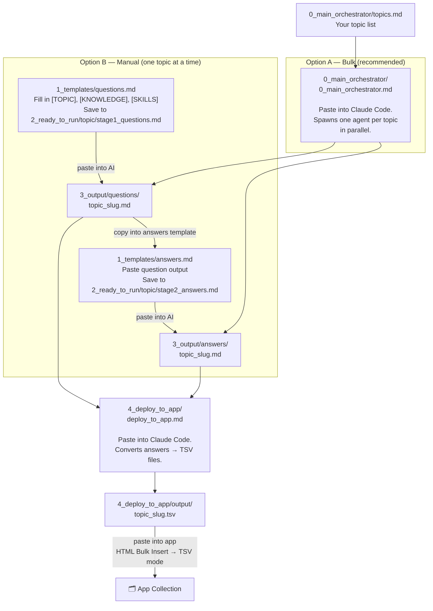

# Prompts — Interview Question Pipeline

This folder runs a 4-stage pipeline: define topics → generate questions → generate answers → deploy to app.

```
prompts/
├── 0_main_orchestrator/      ← run this to kick off everything at once (multi-topic)
│   ├── 0_main_orchestrator.md   the orchestrator prompt
│   └── topics.md                your topic list with knowledge & skills
│
├── 1_templates/              ← the building blocks (don't edit unless improving the prompts)
│   ├── questions.md             template for generating a question set
│   └── answers.md               template for generating model answers
│
├── 2_ready_to_run/           ← filled-in prompts, ready to paste into an AI chat (manual flow)
│   └── dotnet_regex/
│       ├── stage1_questions.md
│       └── stage2_answers.md
│
├── 3_output/                 ← what the AI produced
│   ├── questions/               one file per topic
│   └── answers/                 one file per topic
│
└── 4_deploy_to_app/          ← converts 3_output into TSV files ready to paste into the app
    ├── deploy_to_app.md         the deploy prompt
    └── output/                  generated .tsv files (one per topic)
```

---

## The pipeline



---

## How to run it

### Bulk flow (all topics at once)

1. **Edit your topic list** — open [0_main_orchestrator/topics.md](0_main_orchestrator/topics.md) and add or update topics.
2. **Paste the orchestrator** — paste [0_main_orchestrator/0_main_orchestrator.md](0_main_orchestrator/0_main_orchestrator.md) into this Claude Code chat. One agent per topic fires in parallel.
3. **Deploy** — once `3_output/` is populated, paste [4_deploy_to_app/deploy_to_app.md](4_deploy_to_app/deploy_to_app.md) into Claude Code. It reads all answer files and writes `.tsv` files to `4_deploy_to_app/output/`.
4. **Insert into app** — open the app → HTML Bulk Insert → Tab-Separated (TSV) → pick or create a collection → paste the `.tsv` content → Insert.

---

### Manual flow (one topic at a time)

1. Open [1_templates/questions.md](1_templates/questions.md), fill in `[TOPIC]`, `[KNOWLEDGE LIST]`, `[SKILLS LIST]`.
2. Save as `2_ready_to_run/your_topic/stage1_questions.md` and paste into an AI chat.
3. Save the AI output to `3_output/questions/your_topic.md`.
4. Open [1_templates/answers.md](1_templates/answers.md), paste the question file contents at `[PASTE QUESTION LIST HERE]`.
5. Save as `2_ready_to_run/your_topic/stage2_answers.md` and paste into an AI chat.
6. Save the AI output to `3_output/answers/your_topic.md`.
7. Run the deploy step above.

---

## Tips

- **Knowledge & skills lists** can be copied straight from a job description. The questions template tags each question as `[FROM JD]` or `[INFERRED]` so you know which are role-specific.
- **Iterating:** Tweak questions in `3_output/questions/` and re-run the answers step only — no need to redo Stage 1.
- **The deploy prompt reads from `3_output/answers/` only** — questions are not needed at deploy time.
- **TSV format:** one line per card, `question text [TAB] HTML answer`. The app's HTML Bulk Insert → TSV mode parses it directly.
