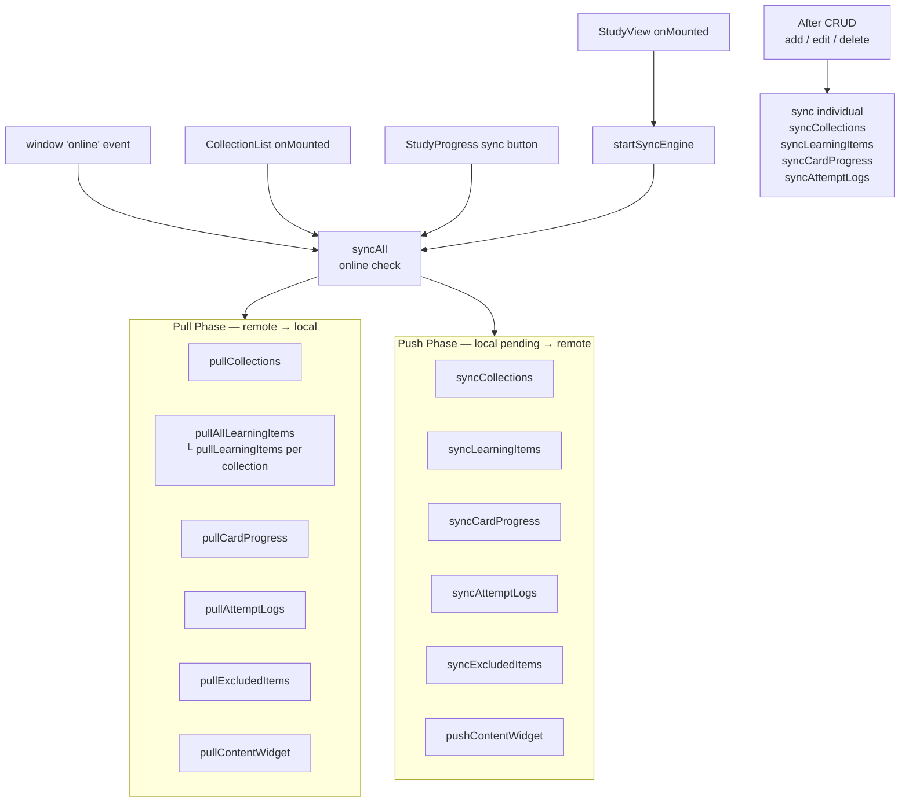
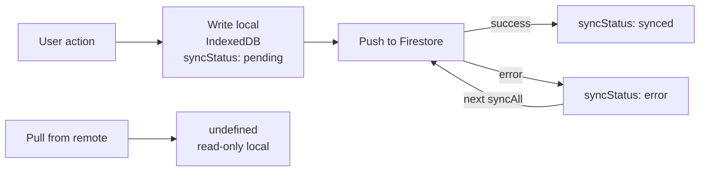
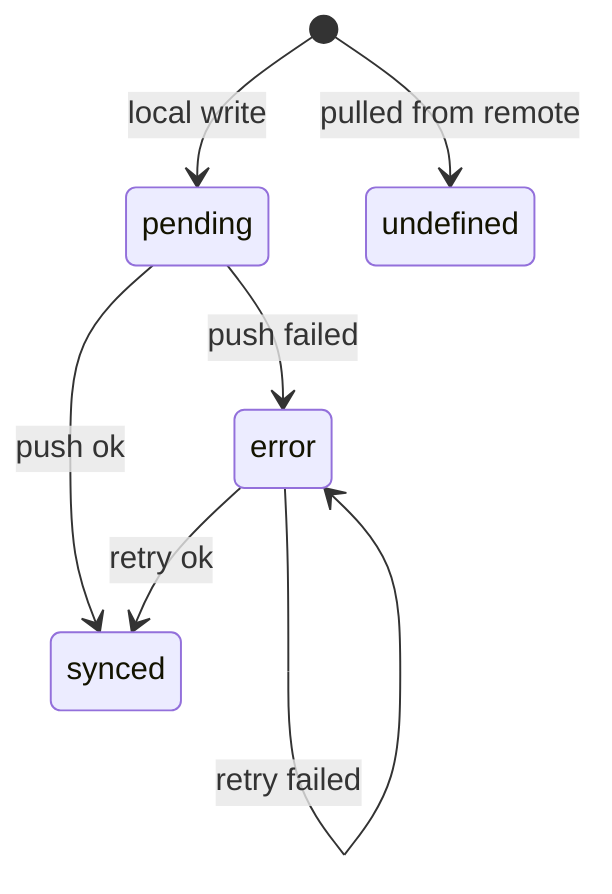

# Sync Architecture

## Flow

## Single Record Lifecycle

## syncStatus Lifecycle

## Conflict Resolution Rules

| Entity | Field used | Winner |
|---|---|---|
| Collections | `lastModified` | Remote if newer, skip if local pending |
| LearningItems | `lastModified` | Remote if newer, cascading delete if missing |
| CardProgress | `last_reviewed_at` | Remote if newer, skip if local pending |
| AttemptLogs | `created_at` | Append-only, insert if missing |
| ExcludedItems | `lastModified` | Remote if newer, cascading delete if missing |
| ContentWidget | `lastModified` | If local pending → push instead of pull |

## Known Issues

- `startSyncEngine()` only called in **StudyView** — `window 'online'` listener is never registered if user never visits study
- `stopSyncEngine()` is defined but **never called** — listener leaks if StudyView mounts multiple times
- Pull button in CollectionItemView only pulls `learningItems` for that collection, not a full sync
