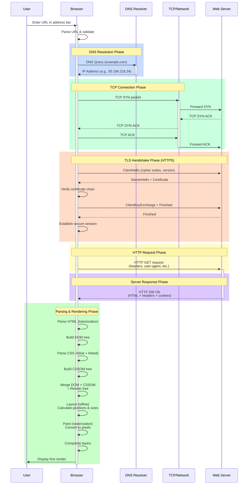

# URL Entry to First Render - Sequence Diagram

## Phase Breakdown

### 1. **DNS Resolution** (50-300ms typical)
- Browser queries recursive resolver
- Resolver checks cache → queries root → TLD → authoritative nameserver
- Returns IP address for domain

### 2. **TCP Connection** (variable, usually <100ms)
- Three-way handshake: SYN → SYN-ACK → ACK
- Establishes reliable connection channel

### 3. **TLS Handshake** (50-300ms, HTTPS only)
- ClientHello → ServerHello + Certificate
- Certificate validation (chain verification)
- Key exchange and encryption setup
- Finished messages confirm secure session

### 4. **HTTP Request**
- Browser sends GET request with headers
- Includes Host, User-Agent, Accept, Cookies, etc.

### 5. **Server Response**
- HTTP status line (200 OK, 404, etc.)
- Response headers (Content-Type, Cache-Control, Set-Cookie, etc.)
- Response body (HTML document)

### 6. **Parsing & Rendering**
- **HTML Parsing**: Tokenize → Build DOM tree
- **CSS Parsing**: Parse stylesheets → Build CSSOM
- **Render Tree**: Combine DOM + CSSOM
- **Layout (Reflow)**: Calculate coordinates and dimensions
- **Paint**: Convert to pixels
- **Composite**: Layer composition
- **First Render**: Display to user

## Key Timing Notes

| Phase | Duration |
|-------|----------|
| DNS Resolution | 50-300ms |
| TCP Connection | 20-100ms |
| TLS Handshake | 50-300ms |
| HTTP Request/Response | 50-500ms (depends on server) |
| Parsing & Rendering | 100-1000ms+ (depends on complexity) |
| **Total (HTTP)** | **~200-900ms** |
| **Total (HTTPS)** | **~300-1200ms** |

