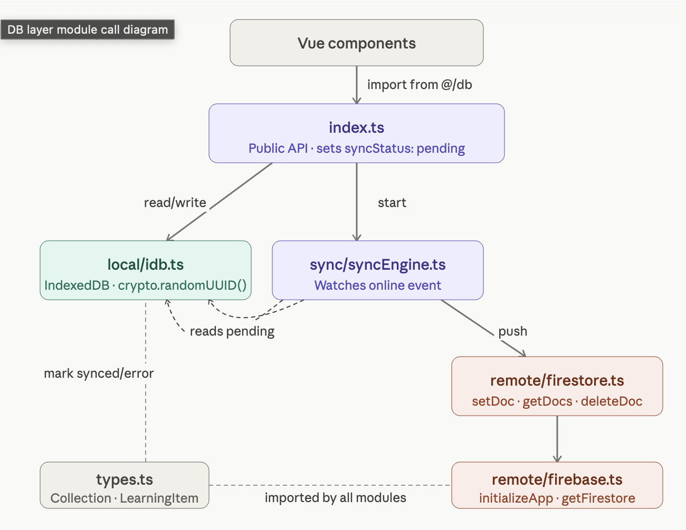

# Offline-First DB Layer

A sync layer that keeps your data local first and pushes to the cloud when connection is available, using **IndexedDB** for local storage and **Firestore** as the remote database.

## How It Works

1. User creates or edits an item
2. Data is saved immediately to **IndexedDB** with `syncStatus: 'pending'`
3. App checks for internet connection
   - **Online** → pushes to Firestore right away, marks item as `synced`
   - **Offline** → item stays `pending` in IDB
4. When connection is restored, the `online` event fires automatically
5. `syncAll()` runs, finds all `pending` items and pushes them to Firestore
6. Each item is marked `synced` on success or `error` on failure



## Storage

| Layer | Technology | Role |
|---|---|---|
| Local | IndexedDB via `idb` | Primary store, always written first |
| Remote | Firebase Firestore | Sync target, written in background |

## Dependencies

```bash
npm install firebase idb
```
